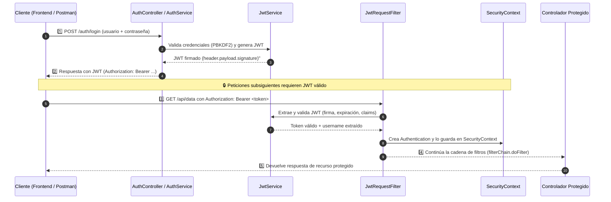

```mermaid
sequenceDiagram
    autonumber
    participant C as Cliente (Frontend / Postman)
    participant A as AuthController / AuthService
    participant J as JwtService
    participant F as JwtRequestFilter
    participant S as SecurityContext
    participant P as Controlador Protegido

    C->>A: 1️⃣ POST /auth/login (usuario + contraseña)
    A->>J: Valida credenciales (PBKDF2) y genera JWT
    J-->>A: JWT firmado (header.payload.signature)"
    A-->>C: 2️⃣ Respuesta con JWT (Authorization: Bearer ...)

    Note over C,S: 🔒 Peticiones subsiguientes requieren JWT válido

    C->>F: 3️⃣ GET /api/data con Authorization: Bearer <token>
    F->>J: Extrae y valida JWT (firma, expiración, claims)
    J-->>F: Token válido + username extraído
    F->>S: Crea Authentication y lo guarda en SecurityContext
    F-->>P: 4️⃣ Continúa la cadena de filtros (filterChain.doFilter)

    P-->>C: 5️⃣ Devuelve respuesta de recurso protegido
```